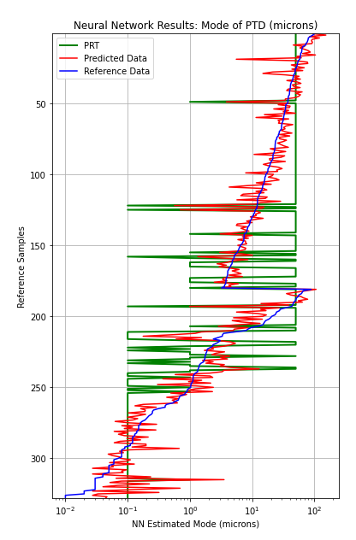

# Estimations-of-Mode-of-Pore-Throat-Distribution-using-Tensorflow
Utilized Tensorflow to estimate the Mode of a Pore Throat Distribution based on Carbonate Core Data
Tensorflow used to Estimate the Mode (microns) of the Pore Throat Distribution from porosity and permeability data calibrated to Clerke's Rosetta Stone Arab D Carbonate dataset.

>**There have been some recent changes to the Jupyter Notebook to reflect the new numpy, pandas and sklearn. Also, we are using the sklearn normalize on our log10 of perm and mode  We also show a more straight-forward technique where you take the log of perm and mode and then and normalize all the data using standard min-max techinques and then de-normalize the same way. Frankly, I like showing our work so that we are not dependant upon sklearn.**

### Introduction
#### Predict Mode of Pore Throats
The objective of this project is to estimate the Mode of the Pore Throat Distribution which would then let us segregate the rock into Macro, Meso and Micro Rock Types (RTs). In this repository we are using Tensorflow  to predict Mode. 

The exact Mode of the PTD (microns) is calculated using Clerke's Thomeer Capillary Pressure parameters and the following Buiting equation:

        mode (microns) = exp(-1.15*G1)/(214/Pd1)

The Arab D data set published by Clerke is quite distinctive. Clerke acquired nearly 450 High Pressure Mercury Injection Capillary Pressure (HPMI) measurements in the Arab D reservoir; however, Clerke's final samples were randomly selected from 1,000's of pre-qualified core samples ensuring a broad distribution and representation of all Petrophysical properties. This created one of the best Core Analysis datasets every collected in our industry. 

Clerke began evaluating this dataset by fitting a Thomeer hyperbolas for each pore system in each sample to generate the published Thomeer Capillary Pressure parameters. From these data Clerke established his Petrophysical Rock Types (PRT) based on the Initial Displacement Pressures for each pore system and the number of pore systems present in each sample. From the figure below it is rather evident that Clerke's PRTs are Petrophysically well-defined in poro-perm space where each color represents a different PRT.  The Capillary Pressure curves and Pore Throat Distributions (PTD) shown on the right hand side of the figure illustrate the unique characteristics of each PRT. 

>

###### The characterization of Clerke's PRTs are shown below:

>

As can be seen in the first figure above, the PRTs are rather well segregated in the Porosity vs. Permeability Cross Plot as they fall in distinct regions or clusters on the Cross Plot.For modeling purposes it is important to take advantage of the excellent correlations between the PRTs. 

This notebook was started from Aman Bhandula's GitHub repository:

https://github.com/Amanbhandula/Prediction-of-reservoir-properties-using-Neural-Network

We used Clerke's Rosetta Stone data and his PRTs as our training set, except that we combined all the macros PRTs into one RT that had a value of 2. We combined all the Type 1 Meso PRT into a RT with a value of 1 and all the Micro PRT compose our third RT with a value of 0. The following is the standard Sigmoid s-curve.

We are using Tensorflow to predict the log10 of the Mode from Porosity and log10 of Permeability. 

Run 1:
We initally make the first training run (Run 1) using 20% of the data for testing with Epochs > 100. Save the training weights from Run 1. 

        #1st run - run > 100 epochs with 20% of the data first for training
        from sklearn.model_selection import train_test_split
        df_train, df_test = train_test_split(df, test_size=0.2)

        '''
        Save the checkpoint training weights and load them again if needed per lines below:
        '''
        if epochs > 100: 
            if input('Save model ? [Y/N]') == 'Y':
                saver.save(sess,'yahoo_dataset.ckpt')
                print('Model Saved') 

 
## Results:
>

1 Clerke, E. A., Mueller III, H. W., Phillips, E. C., Eyvazzadeh, R. Y., Jones, D. H., Ramamoorthy, R., Srivastava, A., (2008) “Application of Thomeer Hyperbolas to decode the pore systems, facies and reservoir properties of the Upper Jurassic Arab D Limestone, Ghawar field, Saudi Arabia: A Rosetta Stone approach”, GeoArabia, Vol. 13, No. 4, p. 113-160, October 2008. 
